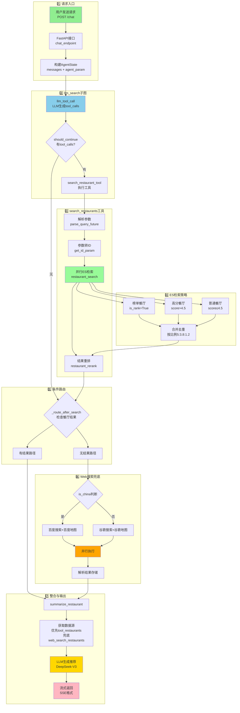

```mermaid
graph TB
    subgraph "1️⃣ 请求入口"
        A1[用户发送请求<br/>POST /chat]
        A2[FastAPI接口<br/>chat_endpoint]
        A3[构建AgentState<br/>messages + agent_param]
    end
    
    subgraph "2️⃣ llm_search子图"
        B1[llm_tool_call<br/>LLM生成tool_calls]
        B2{should_continue<br/>有tool_calls?}
        B3[search_restaurant_tool<br/>执行工具]
    end
    
    subgraph "3️⃣ search_restaurants工具"
        C1[解析参数<br/>parse_query_future]
        C2[参数转ID<br/>get_id_param]
        C3[并行ES检索<br/>restaurant_search]
        C4[结果重排<br/>restaurant_rerank]
    end
    
    subgraph "4️⃣ ES检索策略"
        D1[榜单餐厅<br/>is_rank=True]
        D2[高分餐厅<br/>score>4.5]
        D3[普通餐厅<br/>score≤4.5]
        D4[合并去重<br/>按比例5:3.8:1.2]
    end
    
    subgraph "5️⃣ 条件路由"
        E1{_route_after_search<br/>检查餐厅结果}
        E2[有结果路径]
        E3[无结果路径]
    end
    
    subgraph "6️⃣ Web搜索兜底"
        F1{is_china判断}
        F2[百度搜索+百度地图]
        F3[谷歌搜索+谷歌地图]
        F4[并行执行]
        F5[解析结果存储]
    end
    
    subgraph "7️⃣ 整合与输出"
        G1[summarize_restaurant]
        G2[获取数据源<br/>优先tool_restaurants<br/>兜底web_search_restaurants]
        G3[LLM生成推荐<br/>DeepSeek-V3]
        G4[流式返回<br/>SSE格式]
    end
    
    A1 --> A2 --> A3
    A3 --> B1
    
    B1 --> B2
    B2 -->|有| B3
    B2 -->|无| E1
    
    B3 --> C1 --> C2 --> C3 --> C4
    C3 --> D1 & D2 & D3
    D1 & D2 & D3 --> D4
    D4 --> C4
    
    C4 --> E1
    E1 --> E2 & E3
    
    E2 --> G1
    E3 --> F1
    
    F1 -->|是| F2
    F1 -->|否| F3
    F2 & F3 --> F4 --> F5 --> G1
    
    G1 --> G2 --> G3 --> G4
    
    style A1 fill:#90EE90
    style G4 fill:#FFB6C1
    style B1 fill:#87CEEB
    style C3 fill:#98FB98
    style F4 fill:#FFA500
    style G3 fill:#FFD700
```
